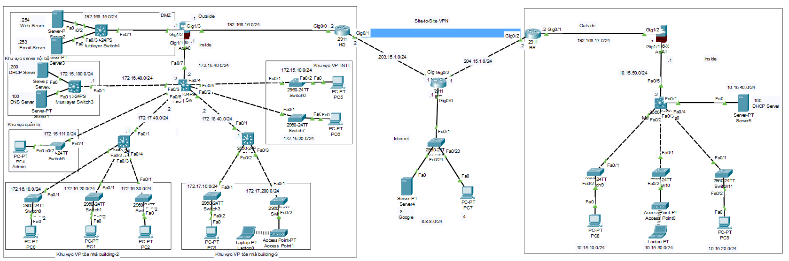

# Enterprise Network Design & Implementation (Mô phỏng Mạng Doanh Nghiệp)

## 📌 Giới thiệu dự án
Dự án này mô phỏng việc thiết kế và cấu hình hạ tầng mạng hoàn chỉnh cho một doanh nghiệp, bao gồm Hội sở chính (HQ) và một Chi nhánh (Branch). Hệ thống được thiết kế để đảm bảo tính sẵn sàng cao, bảo mật chặt chẽ và khả năng giao tiếp xuyên suốt giữa các chi nhánh thông qua môi trường Internet.

## 🏢 Kiến trúc hệ thống

### 1. Hội sở chính (HQ)
Hội sở được chia thành 3 tòa nhà với cấu trúc phân cấp:
**Building 1 (Trung tâm):** Đặt CoreSwitch quản lý lưu lượng chính và kết nối với 2 phòng ban thuộc khu vực VP TNTT.
**Building 2 & Building 3:** Mỗi tòa nhà trang bị 1 Distribution Switch kết nối về CoreSwitch, phục vụ lần lượt 3 và 2 phòng ban.
**Hệ thống Server:** * **Public Servers:** Web Server và Email Server cung cấp dịch vụ ra ngoài Internet.
    **Internal Servers:** DHCP Server và DNS Server phục vụ mạng nội bộ.
**Khu vực quản trị:** Cho phép người quản trị cấu hình từ xa qua Telnet/SSH.
**Bảo mật:** Trang bị Firewall để bảo vệ mạng nội bộ khỏi các mối đe dọa từ bên ngoài.

### 2. Chi nhánh (Branch)
Bao gồm 3 phòng ban và có hệ thống DHCP Server riêng cấp phát IP cho người dùng.
Được bảo vệ bởi Firewall riêng biệt.

## 🛠️ Công nghệ và Kỹ thuật áp dụng
Dự án áp dụng các kỹ thuật mạng cốt lõi (sử dụng Cisco Packet Tracer / GNS3):

**Switching:** Cấu hình VLAN để phân chia broadcast domain, sử dụng VTP để đồng bộ VLAN và cấu hình đường Trunking giữa các Switch.
**Routing:** Cấu hình định tuyến (Động) đảm bảo các thiết bị trong mạng nội bộ giao tiếp được với nhau.
* **NAT (Network Address Translation):**
    **NAT Overloading (PAT):** Cho phép người dùng nội bộ truy cập Internet.
    **Static NAT:** Public Web Server (IP: `203.15.1.100`) và Email Server (IP: `203.15.1.101`) ra môi trường Internet.
**VPN (Virtual Private Network):** Triển khai cấu hình **IPSec VPN Site-to-Site** kết nối an toàn giữa Branch và HQ, cho phép chi nhánh sử dụng các ứng dụng nội bộ đặt tại hội sở.

## 🖼️ Sơ đồ mạng (Network Topology)

## 🚀 Hướng dẫn cài đặt và kiểm tra
1. Tải phần mềm mô phỏng Cisco Packet Tracer.
2. Mở file project: `[Enterprise-Network-Design-and-Implementation].pkt`
3. Các kịch bản kiểm tra (Test cases):
   * Ping kiểm tra kết nối nội bộ giữa các phòng ban trong hệ thống.
   * Dùng PC ở ngoài Internet truy cập vào Web Server bằng IP public `203.15.1.100`.
   * Gửi gói tin từ Branch sang HQ qua đường hầm VPN Site-to-Site.

## 📝 Thông tin cá nhân
* Dự án môn học Mạng máy tính nâng cao
